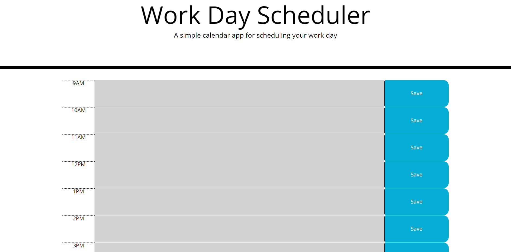

# Daily-Planner

This week's homework was to make a daily planner.

Using local storage and user input we were able to accomplish this.

For loops made it so the only hours accessible were 9AM-5PM.

When the user inputs the Todos per hour, 
    and then clicks the save button,
the application saves the input from the user to use throughout the day.

Deployed Site: https://umbrecon1.github.io/Daily-Planner/